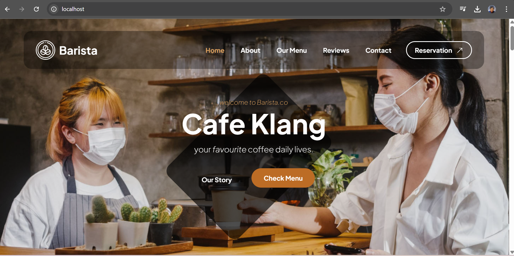
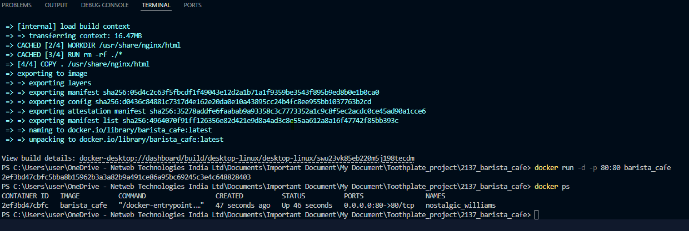

# Barista Cafe - Dockerized Static Website Deployment to AWS EKS

## Overview
This repository contains a static website (Barista Cafe) that is served using **Nginx** within a Docker container. The project is configured to be built and deployed to **AWS Elastic Kubernetes Service (EKS)** using **GitHub Actions** and **AWS Elastic Container Registry (ECR)**.   
 

  

## Features
- **Dockerized Static Website**: Uses Nginx to serve static content.
- **AWS ECR for Image Storage**: Stores the Docker image in AWS Elastic Container Registry.
- **AWS EKS for Deployment**: Runs the website on Kubernetes.
- **GitHub Actions for CI/CD**: Automates the build and deployment process.

---

## Folder Structure
```
📂 2137_BARISTA_CAFE
├── 📁 css
├── 📁 fonts
├── 📁 images
├── 📁 js
├── 📁 videos
├── 📄 index.html
├── 📄 reservation.html
├── 📄 Dockerfile
└── 📄 ABOUT THIS TEMPLATE.txt
```

---

# 1️⃣ Testing Locally with Docker

## Step 1: Clone the Repository
```sh
git clone https://github.com/your-repository.git
cd your-repository
```

## Step 2: Build the Docker Image
```sh
docker build -t barista_cafe .
```

## Step 3: Run the Docker Container Locally (Optional)
```sh
docker run -d -p 80:80 --name barista_cafe barista_cafe
```
Access the website at `http://localhost/`.

---

# 2️⃣ Automated Deployment with GitHub Actions

## Step 4: Push the Image to AWS ECR

#### **1. Authenticate Docker with AWS ECR**
```sh
aws ecr get-login-password --region us-east-1 | docker login --username AWS --password-stdin <AWS_ACCOUNT_ID>.dkr.ecr.us-east-1.amazonaws.com
```

#### **2. Create an ECR Repository (if not already created)**
```sh
aws ecr create-repository --repository-name barista-cafe
```

#### **3. Tag and Push the Image to ECR**
```sh
ACCOUNT_ID=$(aws sts get-caller-identity --query "Account" --output text)
IMAGE_URI="$ACCOUNT_ID.dkr.ecr.us-east-1.amazonaws.com/barista-cafe:latest"
docker tag barista_cafe $IMAGE_URI
docker push $IMAGE_URI
```

## Step 5: Deploy to AWS EKS

#### **1. Update kubeconfig to access EKS Cluster**
```sh
aws eks update-kubeconfig --region us-east-1 --name my-eks-cluster
```

#### **2. Deploy to Kubernetes**
```sh
kubectl set image deployment/nginx-deployment nginx=$IMAGE_URI -n default
kubectl rollout status deployment/nginx-deployment -n default
```

---

## GitHub Actions Workflow
### **GitHub Secrets Required**
Go to `Settings > Secrets and Variables > Actions` and add:
- `AWS_ACCESS_KEY_ID`
- `AWS_SECRET_ACCESS_KEY`
- `AWS_REGION` (e.g., `us-east-1`)
- `ECR_REPOSITORY` (e.g., `barista-cafe`)

### **GitHub Actions Workflow File (`.github/workflows/deploy.yml`)**
```yaml
name: Deploy to EKS

on:
  push:
    branches:
      - main  # Trigger workflow when code is pushed to main

env:
  AWS_REGION: us-east-1  # Change this to your AWS region
  ECR_REPOSITORY: barista-cafe  # Your ECR repo name
  CLUSTER_NAME: my-eks-cluster  # Your EKS cluster name
  DEPLOYMENT_NAME: nginx-deployment  # Your Kubernetes deployment name
  IMAGE_TAG: latest  # Image tag to use

jobs:
  build-and-push:
    name: Build & Push Docker Image to ECR
    runs-on: ubuntu-latest

    steps:
      - name: Checkout Code
        uses: actions/checkout@v4

      - name: Configure AWS Credentials
        uses: aws-actions/configure-aws-credentials@v2
        with:
          aws-access-key-id: ${{ secrets.AWS_ACCESS_KEY_ID }}
          aws-secret-access-key: ${{ secrets.AWS_SECRET_ACCESS_KEY }}
          aws-region: ${{ env.AWS_REGION }}

      - name: Login to Amazon ECR
        id: login-ecr
        run: |
          aws ecr get-login-password --region $AWS_REGION | docker login --username AWS --password-stdin $(aws sts get-caller-identity --query "Account" --output text).dkr.ecr.$AWS_REGION.amazonaws.com

      - name: Build & Tag Docker Image
        run: |
          ACCOUNT_ID=$(aws sts get-caller-identity --query "Account" --output text)
          IMAGE_URI="$ACCOUNT_ID.dkr.ecr.$AWS_REGION.amazonaws.com/$ECR_REPOSITORY:$IMAGE_TAG"
          docker build -t $IMAGE_URI .
          docker push $IMAGE_URI
          echo "IMAGE_URI=$IMAGE_URI" >> $GITHUB_ENV

  deploy:
    name: Deploy to EKS
    runs-on: ubuntu-latest
    needs: build-and-push

    steps:
      - name: Configure AWS Credentials
        uses: aws-actions/configure-aws-credentials@v2
        with:
          aws-access-key-id: ${{ secrets.AWS_ACCESS_KEY_ID }}
          aws-secret-access-key: ${{ secrets.AWS_SECRET_ACCESS_KEY }}
          aws-region: ${{ env.AWS_REGION }}

      - name: Update kubeconfig
        run: |
          aws eks update-kubeconfig --region $AWS_REGION --name $CLUSTER_NAME

      - name: Deploy to EKS
        run: |
          kubectl set image deployment/$DEPLOYMENT_NAME nginx=$IMAGE_URI -n default
          kubectl rollout status deployment/$DEPLOYMENT_NAME -n default
```

---

## Accessing the Deployed Website
Once deployed, you can access the website using the external URL of the **LoadBalancer** service:
```sh
kubectl get svc -n default
```
Copy the `EXTERNAL-IP` and open it in your browser.

---

## Cleanup
To delete the deployment from EKS:
```sh
kubectl delete deployment nginx-deployment -n default
```
To delete the ECR repository:
```sh
aws ecr delete-repository --repository-name barista-cafe --force
```
To delete the EKS cluster:
```sh
eksctl delete cluster --name my-eks-cluster
```

---

## Conclusion
This setup automates the deployment of a static website using **Docker, AWS ECR, EKS, and GitHub Actions**. The process ensures seamless CI/CD while hosting the website on a scalable Kubernetes environment.

🚀 **Happy Deploying!**

